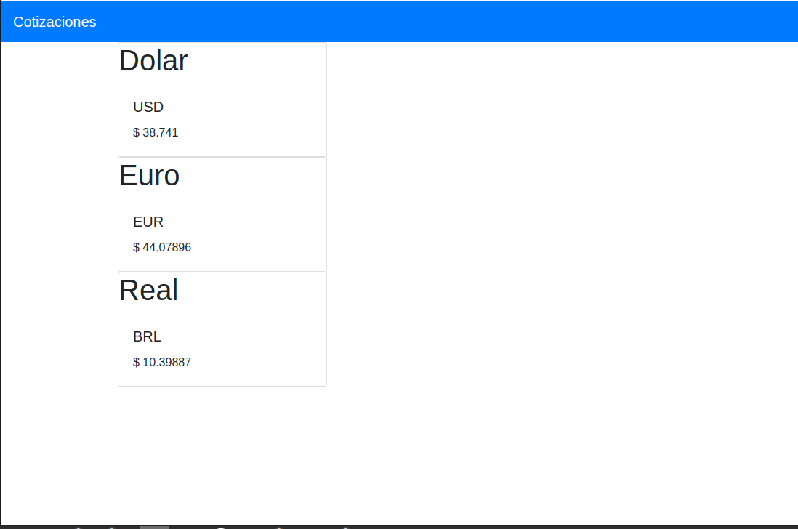

# Web Api RESTful Front End - Angular 

Front End desarrollado en Angular que consume Web API financiera que permite visualizar la cotización en tiempo real de 3 monedas: Dolar, Euro y Real.

## Comenzando

Siga las instrucciones para poder correr el proyecto en su maquina local. 

### Prerrequisitos de Instalación 

NPM debe estar instalado. Para instalar NPM. [Vea aquí](https://www.npmjs.com/get-npm)

Se debe tener instalado Node. Para instalar Node [Vea aquí](https://howtonode.org/how-to-install-nodejs)

Angular y Angular CLI deben estar instalados. Para instalarlos [Vea aquí](https://victorroblesweb.es/2018/05/23/instalar-angular-6-con-angular-cli/)


### Despliegue en el servidor

Descargue el repositorio y dentro de él abra la Consola y escriba:

```
ng serve
```

Ya puede probar la app desde el navegador(chrome) en la siguiente dirección:

```
http://localhost:4200/home
```


### Rutas

```
/cotizacion/home
```

## Version

1.0.0

## Autor

* **Alejandro Recalde** - *Developer - Rubenrecalde@live.com.ar


## Licencia

Este proyecto esta licenciado bajo la licencia Creative Commons Attribution Share Alike 4.0	cc-by-sa-4.0

